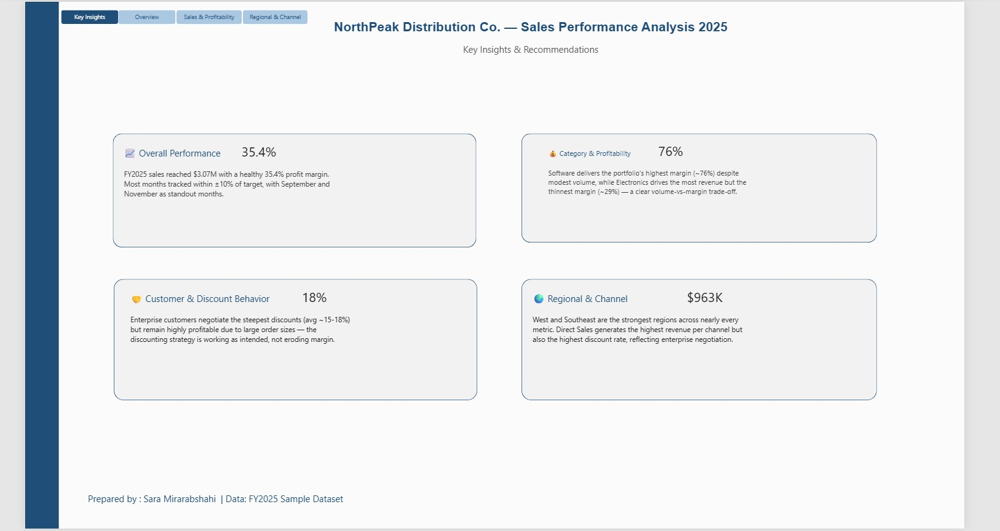
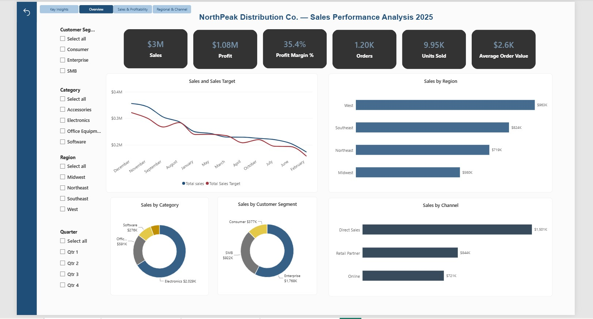
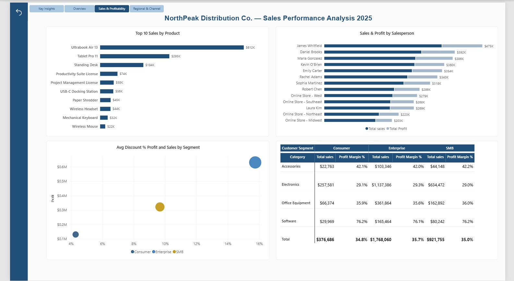
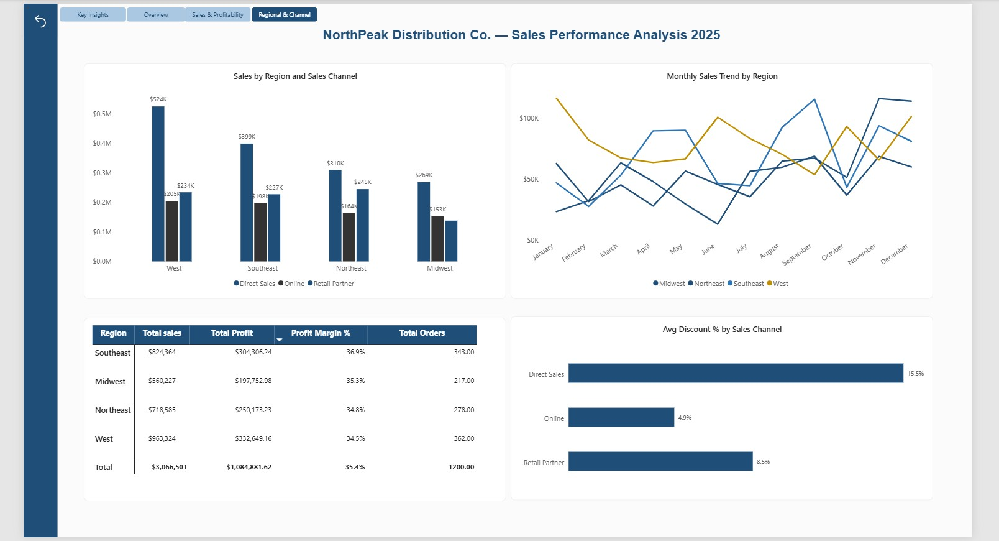

# NorthPeak Sales Performance Dashboard

End-to-end sales analytics project: a realistic 1,200-order dataset 
built in Excel with formula-driven business logic, connected to an 
interactive 4-page Power BI dashboard.

## Overview
- 1,200 orders across 12 months of 2025
- Realistic pricing, discount, and cost-margin logic by category and segment
- Data model with calendar table and DAX measures
- 4 dashboard pages: Executive Overview, Profitability Deep Dive, 
  Regional & Channel Performance, and Key Insights

## Screenshots

### Key Insights

### Executive Overview

### Sales & Profitability

### Regional & Channel

## Files
- Power BI file (open with Power BI Desktop, free) — see the `.pbix` file above
- Source dataset with formula-linked tables — see the `.xlsx` file above

## Tools used
Excel, Power BI Desktop, DAX, Power Query
